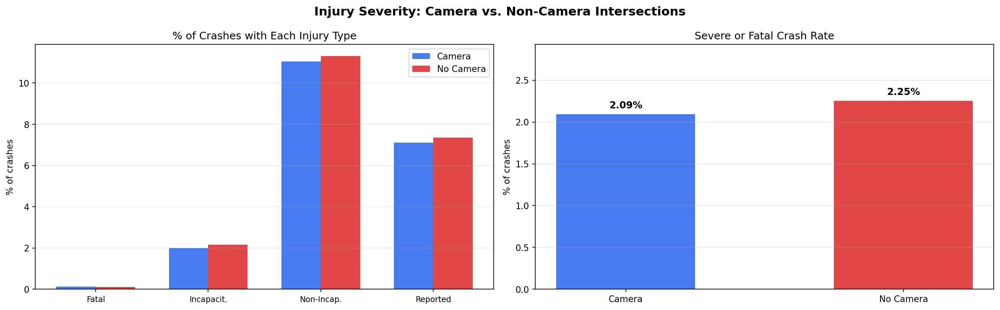
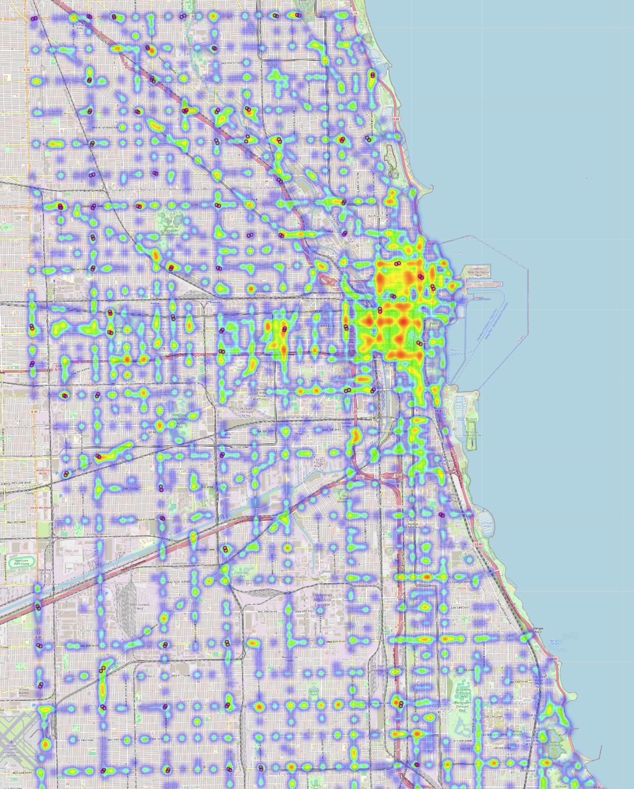

# IS477-JK-Spring-2026: Impact of Red Light Cameras on Crash Injury
## Contributors
- Jessica Pei
- Karena Liang

## Summary
Traffic safety in a big city can be difficult with the large amount of people and vehicles that have to share space on the road. In larger cities like Chicago, this is something that is even more important to keep in mind and to enforce regulations that can ensure the safety of those who live in the area. In order to manage this, red light cameras were introduced to reduce risky driving behavior by targeting those who run red lights. The goal of this project is to evaluate the effectiveness of automated red light cameras in contributing to traffic safety in Chicago. By analyzing crash data in sections with and without red light camera installations, we will determine whether they are associated with significant reductions in traffic crashes by looking at the severity of the injuries caused by the crashes among intersections with and without red light cameras, instead of just analyzing crash frequency. Since many studies assess whether cameras reduce the number of crashes, we wanted to understand whether they reduce the severity of crashes to get more information from a public health and policy perspective. If red light cameras are helpful and effective, we would expect intersections equipped with cameras to have less severe injury outcomes in comparison to the intersections without the cameras.
    
The analysis will use two datasets from the Chicago Data Portal: Red Light Camera Locations, and Traffic Crashes - Crashes. The camera dataset provides geographic coordinates and operational details for red-light cameras across the city, while the crash dataset contains detailed information on individual crashes, including injury severity metrics such as total injuries, fatal injuries, and levels of incapacitation. In using these datasets together, we can compare crashes and the injury severity across locations with and without red light cameras.
    
After cleaning and filtering the data to include only signalized intersections within a defined geographic area, we used a spatial nearest-neighbor approach to match crashes to nearby camera locations and classify whether each crash occurred at a camera-equipped intersection. Our analysis compares injury severity outcomes including fatal, incapacitating, and non-incapacitating injuries between intersections with and without red-light cameras. The final results show that while intersections with cameras have slightly lower proportions of some non-fatal injury categories, the overall differences in injury severity between the two groups are not very large. Something particularly interesting was that the proportion of fatal crashes was actually marginally higher at camera-equipped intersections. However, this difference is also small and most likely influenced by other latent factors such as traffic volume and intersection characteristics.  

Overall, our final results show that red-light cameras may play a role in driver behavior. However, their impact on reducing crash injury severity seems to be limited. These results highlight the importance of considering broader contextual factors such as road design, traffic density, and camera placement when evaluating the effectiveness of traffic safety interventions. There could be a variety of other factors like the fact that many intersections may have red light cameras but drivers who may be a bit more reckless may not notice there is one present, poor intersection design such as the number of lanes and visibility conditions, and even the fact that intersections with cameras are often placed in already high-traffic or historically high-crash areas; all of which can all influence crash outcomes.

## Data profile:
[Link to the original csv files.](https://uofi.box.com/s/jzwvl0p638izb65d56w9b57dez4inp8q )

Red_Light.csv: Red Light Camera Locations
* Structure & Content: The dataset records the location, first operational date, and camera approaches for red light cameras across Chicago. The "approach" describes the originating direction of travel monitored by each camera. The columns are: INTERSECTION (street address of the camera intersection), FIRST APPROACH, SECOND APPROACH, THIRD APPROACH (directional codes such as EB, WB, NB, SB, NWB, SWB indicating the traffic directions monitored), GO LIVE DATE (the date the camera became operational), LATITUDE, and LONGITUDE. 
* Characteristics: 300 rows, each row represents one intersection, not one individual camera, so a single row may capture multiple directional approaches. 

Traffic_Crashes.csv: Traffic Crashes – Crashes
* Structure & Content: Crash data shows information about each traffic crash on city streets within the City of Chicago limits and under the jurisdiction of the Chicago Police Department (CPD). Records are drawn from CPD's electronic crash reporting system (E-Crash), excluding any personally identifiable information, and are added to the portal when a crash report is finalized or amended. The dataset contains 48 columns, in our project we will be using 'CRASH_RECORD_ID', 'CRASH_DATE',   'POSTED_SPEED_LIMIT', 'INJURIES_TOTAL', 'INJURIES_FATAL',  'INJURIES_INCAPACITATING', 'INJURIES_NON_INCAPACITATING'. 'INJURIES_REPORTED_NOT_EVIDENT', 'INJURIES_NO_INDICATION', 'INJURIES_UNKNOWN', 'LATITUDE', 'LONGITUTDE',
* Characteristics: The dataset contains 1043004 records and is updated regularly. About half of all crash reports, mostly minor crashes, are self-reported at the police district by the drivers involved; the other half are recorded on-scene by a responding officer.

Ethical & Legal Constraints
Both datasets are released under the City of Chicago's open data license, which permits free use for research, analysis, and publication without charge or registration. The crash dataset excludes any personally identifiable information, so individual drivers, passengers, or pedestrians cannot be identified.

Relation to Questions:
The two datasets are joined spatially by matching crash coordinates from the Traffic Crashes dataset to intersection coordinates from the Red Light Camera Locations dataset, creating a binary variable that labels each crash as occurring at a camera-equipped intersection or not. This camera-presence variable becomes the independent variable across all three research questions, while injury severity fields from the Traffic Crashes dataset serve as the dependent variables being compared. Together, the datasets supply everything needed to construct the two groups being compared. intersections with cameras and intersections without, and to measure the injury severity outcomes that determine whether red light cameras are associated with safer crash results.


## Data quality: 
|  | Traffic Crashes | Red Light Cameras|
| -------- | -------- | -------- |
| Accuracy | Since approximately half of these reports are self-reported at police stations rather than at the scene, some of the crash parameters like weather/street conditions or posted speed limits rely on the memory of the reporting individual or the officer's best available info. The metadata notes that many of these may disagree with posted information or other assessments on road conditions. | The data is coming from a variety of city-managed hardware. Each entry includes precise geographical coordinates and the specific "approaches" (directions of travel) monitored. |
| Completeness | The data may not be fully complete in the sense that not every single crash in Chicago is included in the data, as a traffic crash within the city limits for which CPD is not the responding police agency, typically crashes on interstate highways, freeway ramps, and on local roads along the City boundary, are excluded from this dataset, among other requirements for crashes that can be reported as per Illinois statute. | After an initial analysis of the data, there is no reason to believe the data is not complete, with 300 active intersections listed. |
| Timeliness | Last updated May 5, 2026, updates daily | Last updated April 24, 2026, although metadata says it's updated daily, so there may be some delay though it may be due to no new information |
| Consistency | According to the metadata, the data follows the format specified in the Traffic Crash Report, SR1050, of the Illinois Department of Transportation. This makes it easier to combine with other traffic or crash related datasets from the Chicago Data Portal since it will have the same formatting and uses a unique crash record ID for each observation that can be used to merge with other datasets. | Follows the same format as the traffic crash data, can clearly see the intersection and location fields as well as the semantic styling are formatted to match. 

## Data cleaning:
The cleaning process began with a geographic bounding box filter applied to both datasets through a shared `clean_dataframe()` function, which first dropped any rows missing `LATITUDE` or `LONGITUDE` values entirely, then retained only records falling within a defined rectangular boundary spanning from W Irving Park Rd to 71st St (latitude) and Cicero Ave to Lake Michigan (longitude). This addressed two issues at once: records with null coordinates could not be spatially joined to camera locations, and records outside Chicago's core street grid such as highway crashes or data entry errors placing crashes outside the city that would introduce noise into the intersection-level comparison.

For the Traffic Crashes dataset specifically, rows missing `INJURIES_TOTAL` were dropped because that field is the primary outcome variable across all three research questions, and imputing injury counts would be inappropriate given how directly they affect conclusions about severity. Additionally, crashes were filtered to only those where `TRAFFIC_CONTROL_DEVICE` was either `'TRAFFIC SIGNAL'` or `'FLASHING CONTROL SIGNAL'`, which restricted the analysis to crashes occurring at signalized intersections, the same type of location where red light cameras are installed, making the camera vs. non-camera comparison methodologically valid rather than comparing camera intersections against uncontrolled mid-block locations or stop-sign intersections that are structurally different environments.

After resetting the camera index and assigning each camera a unique ID, we converted all coordinates to radians and built a BallTree spatial index on the camera locations. For every crash, we queried the tree to find the nearest red‑light camera, calculated the haversine distance, and converted it to meters (multiplying by Earth’s radius). Finally, we flagged a crash as having a red‑light camera if the distance was ≤ 50 meters and stored the matched camera’s ID, producing a final dataset that links each crash to its nearest camera and indicates whether it occurred near one.


## Findings:
**Injury Severity Comparison Table**

The proportional breakdown of injury types across camera and non-camera intersections revealed surprisingly small differences between the two groups. Fatal crashes represented 0.136% of crashes at camera intersections compared to 0.110% at non-camera intersections, meaning camera intersections actually had a marginally higher fatal crash rate, though the raw count difference (24 vs. 180) reflects the much larger volume of crashes at non-camera locations. Incapacitating injuries were slightly lower at camera intersections (1.996%) than non-camera intersections (2.156%), and non-incapacitating injuries followed the same pattern (11.052% vs. 11.301%). Reported-but-not-evident injuries were also marginally lower at camera intersections (7.111% vs. 7.359%). Across every injury category, the differences are less than 0.3 percentage points, suggesting that red light camera presence is associated with only a negligible reduction in the proportion of severe crashes at signalized intersections in Chicago.
| Injury Type           | Camera %   | No Camera % | Camera Count | No Camera Count |
|-----------------------|------------|-------------|--------------|-----------------|
| Fatal                 | 0.136093   | 0.110490    | 24           | 180             |
| Incapacitating        | 1.996031   | 2.155792    | 352          | 3512            |
| Non-Incapacitating    | 11.051885  | 11.301332   | 1949         | 18411           |
| Reported/Not Evident  | 7.110859   | 7.358664    | 1254         | 11988           |

**Bar Charts**

The bar chart reinforces the tabular findings by visually showing that the distribution of injury severity is nearly identical between camera and non-camera intersections. For each injury category: fatal, incapacitating, non-incapacitating, and reported, the bars for the two groups are almost indistinguishable, with differences consistently under 0.3 percentage points. Non-incapacitating injuries make up the largest share in both groups (≈11%), followed by reported injuries (≈7%), while fatal crashes remain extremely rare (≈0.1%) regardless of camera presence. 


**Heatmap Visualization**

The weighted heatmap overlays injury-weighted crash density across the study area, with red light camera locations marked as purple dots. The heat intensity is weighted by severity, fatal crashes contributing the most weight (3), incapacitating injuries next (2), and non-incapacitating injuries least (1), so the hottest areas represent concentrations of the most harmful crashes rather than simply the most frequent ones. The map reveals that the densest clusters of severe crashes are concentrated in the downtown Loop area and along major arterial corridors on the South and West Sides, with notably high-intensity zones along Lake Shore Drive adjacent corridors. Purple camera markers are visible throughout the city but are not consistently co-located with the highest-severity hotspots, which visually reinforces the tabular finding that camera placement alone does not appear to dramatically suppress severe injury outcomes at the intersection level. 

Below is a static view: 



## Future work:
One lesson we definitely learned was that it’s important to highlight and/or consider the latent factors in a relationship between two variables and the extent to which we can associate the results of an analysis with the questions and/or relationship(s) we are focused on in the analysis. In our case, we realized that something to keep in mind with the red-light cameras and its relation to crash/injury severity is that some or maybe many of the cameras may have been placed there because of prior issues or influx of crashes in that intersection or location already as well as how exact the boundaries of the intersection should or could be with being able to detect whether crashes are happening (such as a crash happening 100 feet away from the camera could be due to a person seeing the camera and slamming on the brakes, but it could also be something completely unrelated like the driver seeing an animal on the road. 
  
There were also a lot of technical aspects of the data that we had trouble with in the beginning in terms of being able to align the dates of when cameras were installed with when the crash data recording started, which highlights the importance of the consistency aspect of data quality, in being able to combine data to analyze together not just merging the data together, but also being able to align the data in a way where the attributes and the observations still make sense in the context of the data and the domain. To build upon the findings we already have, we could focus more on environmental variables or some of those other external factors mentioned prior in this report that could be accounted for. 
  
We could potentially include a dataset that adds traffic volume at the certain date and time the crash happened, along with street visibility from time of day with the street lighting and pedestrian infrastructure. With the traffic data, it would be helpful to see if the crashes are happening due to the presence of cameras or due to high traffic at that given timestamp, or even due to holiday or special events like concerts or festivals that could drive in a lot more potential for crashes than normal.
  
We could also take a step back and try to include the speed cameras dataset as originally intended after finding the optimal point of time to have complete data at least within a certain time frame. That way, we could inspect and analyze the differences in crashes and severity of intersections before and after the two different types of cameras were installed. If possible, it may also be interesting to include some data from whether or not the cameras were identified on apps like Google maps, Apple Maps, or Waze, where drivers are notified in advance from other drivers that a speed camera, red light camera, or speed traps are located. With modeling, we could also build a machine learning model to predict future hotspots where cameras could help alleviate crashes by identifying potential high risk areas for crashes or even just other factors that could lead to crashes like high traffic spots, poor street design and/or infrastructure. 

## Challenges:
* Spatial Joining Without Exact Address Matching: The most significant technical challenge was linking the two datasets, since they share no common key. Matching crashes to camera intersections required a proximity-based spatial join using latitude and longitude, which introduced a radius-selection problem: too small a radius would miss crashes genuinely occurring at camera intersections, while too large a radius would incorrectly assign camera status to crashes at nearby but unequipped intersections. This threshold decision directly affects every downstream result and has no objectively correct answer.
* Dataset Size and Filtering Decisions: The Traffic Crashes dataset contains over 1000000 records, and each filtering decision, restricting to signalized intersections, applying the geographic bounding box, dropping rows with missing injury data, reduced the sample in ways that could introduce their own biases. For instance, filtering to only traffic signal and flashing signal controlled intersections was necessary for a fair comparison but also meant discarding a large portion of the data, and there was no straightforward way to verify that the remaining sample was still representative of the broader crash landscape.

## Reproducing: 
Follow these steps to reproduce the analysis from the raw data to the final figures and interactive map.

1. Check Python version, this project requires **Python 3.11 or higher**.  

2. Follow this [link](https://uofi.app.box.com/folder/380303426165) and download Red_Light.csv and Traffic_Crashes.csv. Move both csv files to the data folder.

3. Clone this repository and create a virtual environment.

4. Install required packages
With the virtual environment active, install all dependencies from the provided requirements.txt:

    ```bash
    python -m pip install -r requirements.txt
    
5. Run the Snakemake workflow
    ```bash
    snakemake all --cores 1
    
6. Outputs
After successful execution, the following files will be created:

visualizations/injury_severity_analysis.png – bar charts comparing injury rates near cameras vs. non‑camera intersections.

visualizations/crash_heatmap.html – interactive map showing crash density (weighted by severity) and red‑light camera locations.

To view the HTML map, simply double‑click the file or run a local web server:

    python -m http.server 8000
    
Then open http://localhost:8000/visualizations/crash_heatmap.html in your browser.

## References: 
### Data Licenses
**Traffic Crashes - Crashes**
- Source: Chicago Data Portal
- License: Public Domain
- Terms: Freely available for use and redistribution
- Required citation: United Nations, Department of Economic and Social Affairs, Population Division (2024)

**Red Light Camera Locations**
- Source: Chicago Data Portal
- License: Subject to City of Chicago Data Terms of Use
- Terms: Data is provided on an "as-is" basis; users must indemnify the City and include a mandatory disclaimer on any derivative applications.
- Required citation: City of Chicago, Chicago Police Department (2026). Red Light Camera Locations. Chicago Data Portal.

### Third-Party Software
- **pandas**: BSD 3-Clause License
- **numpy**: BSD License
- **matplotlib**: PSF License
- **sklearn**: BSD 3-Clause License
- **folium**: MIT License (MIT)
